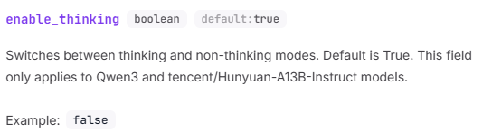
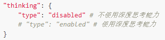

# 模型配置指南

本文档将指导您如何配置 `model_config.toml` 文件，该文件用于配置 MaiBot 的各种AI模型和API服务提供商。

## 配置文件结构

配置文件主要包含以下几个部分：
- 版本信息
- API服务提供商配置
- 模型配置
- 模型任务配置

## 1. 版本信息

```toml
[inner]
version = "1.1.1"
```

用于标识配置文件的版本，遵循语义化版本规则。

## 2. API服务提供商配置

### 2.1 基本配置

使用 `[[api_providers]]` 数组配置多个API服务提供商：

```toml
[[api_providers]]
name = "DeepSeek"                       # 服务商名称（自定义）
base_url = "https://api.deepseek.cn/v1" # API服务的基础URL
api_key = "your-api-key-here"           # API密钥
client_type = "openai"                  # 客户端类型
max_retry = 2                           # 最大重试次数
timeout = 30                            # 超时时间（秒）
retry_interval = 10                     # 重试间隔（秒）
```

### 2.2 配置参数说明

| 参数 | 必填 | 说明 | 默认值 |
|------|------|------|--------|
| `name` | ✅ | 服务商名称，需要在模型配置中引用 | - |
| `base_url` | ✅ | API服务的基础URL | - |
| `api_key` | ✅ | API密钥，请替换为实际密钥 | - |
| `client_type` | ❌ | 客户端类型：`openai`（OpenAI格式）或 `gemini`（Gemini格式，现在支持不良好） | `openai` |
| `max_retry` | ❌ | API调用失败时的最大重试次数 | 2 |
| `timeout` | ❌ | API请求超时时间（秒） | 30 |
| `retry_interval` | ❌ | 重试间隔时间（秒） | 10 |

**请注意，对于`client_type`为`gemini`的模型，`base_url`字段无效。**
### 2.3 支持的服务商示例

#### DeepSeek
```toml
[[api_providers]]
name = "DeepSeek"
base_url = "https://api.deepseek.cn/v1"
api_key = "your-deepseek-api-key"
client_type = "openai"
```

#### SiliconFlow
```toml
[[api_providers]]
name = "SiliconFlow"
base_url = "https://api.siliconflow.cn/v1"
api_key = "your-siliconflow-api-key"
client_type = "openai"
```

#### Google Gemini
```toml
[[api_providers]]
name = "Google"
base_url = "https://api.google.com/v1"
api_key = "your-google-api-key"
client_type = "gemini"  # 注意：Gemini需要使用特殊客户端
```

## 3. 模型配置

### 3.1 基本模型配置

使用 `[[models]]` 数组配置多个模型：

```toml
[[models]]
model_identifier = "deepseek-chat"  # 模型在API服务商中的标识符
name = "deepseek-v3"               # 自定义模型名称
api_provider = "DeepSeek"          # 引用的API服务商名称
price_in = 2.0                     # 输入价格（元/M token）
price_out = 8.0                    # 输出价格（元/M token）
```

### 3.2 高级模型配置

#### 强制流式输出
对于不支持非流式输出的模型：
```toml
[[models]]
model_identifier = "some-model"
name = "custom-name"
api_provider = "Provider"
force_stream_mode = true  # 启用强制流式输出
```

#### 额外参数配置`extra_params`
```toml
[[models]]
model_identifier = "Qwen/Qwen3-8B"
name = "qwen3-8b"
api_provider = "SiliconFlow"
[models.extra_params]
enable_thinking = false # 禁用思考
```
这里的 `extra_params` 可以包含任何API服务商支持的额外参数配置，**配置时应参考相应的API文档**。

比如上面就是参考SiliconFlow的文档配置配置的`Qwen3`禁用思考参数。



以豆包文档为另一个例子



得到豆包`"doubao-seed-1-6-250615"`的禁用思考配置方法为
```toml
[[models]]
# 你的模型
[models.extra_params]
thinking = {type = "disabled"} # 禁用思考
```
请注意，`extra_params` 的配置应该构成一个合法的TOML字典结构，具体内容取决于API服务商的要求。

**请注意，对于`client_type`为`gemini`的模型，此字段无效。**
### 3.3 配置参数说明

| 参数 | 必填 | 说明 |
|------|------|------|
| `model_identifier` | ✅ | API服务商提供的模型标识符 |
| `name` | ✅ | 自定义模型名称，用于在任务配置中引用 |
| `api_provider` | ✅ | 对应的API服务商名称 |
| `price_in` | ❌ | 输入价格（元/M token），用于成本统计 |
| `price_out` | ❌ | 输出价格（元/M token），用于成本统计 |
| `force_stream_mode` | ❌ | 是否强制使用流式输出 |
| `extra_params` | ❌ | 额外的模型参数配置 |

## 4. 模型任务配置

### utils - 工具模型
用于表情包模块、取名模块、关系模块等核心功能：
```toml
[model_task_config.utils]
model_list = ["siliconflow-deepseek-v3"]
temperature = 0.2
max_tokens = 800
```

### utils_small - 小型工具模型
用于高频率调用的场景，建议使用速度快的小模型：
```toml
[model_task_config.utils_small]
model_list = ["qwen3-8b"]
temperature = 0.7
max_tokens = 800
```

### replyer - 主要回复模型
首要回复模型，也用于表达器和表达方式学习：
```toml
[model_task_config.replyer]
model_list = ["siliconflow-deepseek-v3"]
temperature = 0.2
max_tokens = 800
```

### planner - 决策模型
负责决定MaiBot该做什么：
```toml
[model_task_config.planner]
model_list = ["siliconflow-deepseek-v3"]
temperature = 0.3
max_tokens = 800
```

### emotion - 情绪模型
负责MaiBot的情绪变化：
```toml
[model_task_config.emotion]
model_list = ["siliconflow-deepseek-v3"]
temperature = 0.3
max_tokens = 800
```

### memory - 记忆模型
```toml
[model_task_config.memory]
model_list = ["qwen3-30b"]
temperature = 0.7
max_tokens = 800
```

### vlm - 视觉语言模型
用于图像识别：
```toml
[model_task_config.vlm]
model_list = ["qwen2.5-vl-72b"]
max_tokens = 800
```

### voice - 语音识别模型
```toml
[model_task_config.voice]
model_list = ["sensevoice-small"]
```

### embedding - 嵌入模型
```toml
[model_task_config.embedding]
model_list = ["bge-m3"]
```

### tool_use - 工具调用模型
需要使用支持工具调用的模型：
```toml
[model_task_config.tool_use]
model_list = ["qwen3-14b"]
temperature = 0.7
max_tokens = 800
```

### lpmm_entity_extract - 实体提取模型
```toml
[model_task_config.lpmm_entity_extract]
model_list = ["siliconflow-deepseek-v3"]
temperature = 0.2
max_tokens = 800
```

### lpmm_rdf_build - RDF构建模型
```toml
[model_task_config.lpmm_rdf_build]
model_list = ["siliconflow-deepseek-v3"]
temperature = 0.2
max_tokens = 800
```

### lpmm_qa - 问答模型
```toml
[model_task_config.lpmm_qa]
model_list = ["deepseek-r1-distill-qwen-32b"]
temperature = 0.7
max_tokens = 800
```

## 5. 配置建议

### 5.1 Temperature 参数选择

| 任务类型 | 推荐温度 | 说明 |
|----------|----------|------|
| 精确任务（工具调用、实体提取） | 0.1-0.3 | 需要准确性和一致性 |
| 创意任务（对话、记忆） | 0.5-0.8 | 需要多样性和创造性 |
| 平衡任务（决策、情绪） | 0.3-0.5 | 平衡准确性和灵活性 |

### 5.2 模型选择建议

| 任务类型 | 推荐模型类型 | 示例 |
|----------|--------------|------|
| 高精度任务 | 大模型 | DeepSeek-V3, GPT-4 |
| 高频率任务 | 小模型 | Qwen3-8B |
| 多模态任务 | 专用模型 | Qwen2.5-VL, SenseVoice |
| 工具调用 | 支持Function Call的模型 | Qwen3-14B |

### 5.3 成本优化

1. **分层使用**：核心功能使用高质量模型，辅助功能使用经济模型
2. **合理配置max_tokens**：根据实际需求设置，避免浪费
3. **选择免费模型**：对于测试环境，优先使用price为0的模型

## 6. 配置验证

### 6.1 必要检查项

1. ✅ API密钥是否正确配置
2. ✅ 模型标识符是否与API服务商提供的一致
3. ✅ 任务配置中引用的模型名称是否在models中定义
4. ✅ 多模态任务是否配置了对应的专用模型

### 6.2 测试配置

建议在正式使用前：
1. 使用少量测试数据验证配置
2. 检查API调用是否正常
3. 确认成本统计功能正常工作

## 7. 故障排除

### 7.1 常见问题

**问题1**: API调用失败
- 检查API密钥是否正确
- 确认base_url是否可访问
- 检查模型标识符是否正确

**问题2**: 模型未找到
- 确认模型名称在任务配置和模型定义中一致
- 检查api_provider名称是否匹配

**问题3**: 响应异常
- 检查温度参数是否合理（0-1之间）
- 确认max_tokens设置是否合适
- 验证模型是否支持所需功能

### 7.2 日志查看

查看 `logs/` 目录下的日志文件，寻找相关错误信息。

## 8. 更新和维护

1. **定期更新**: 关注API服务商的模型更新，及时调整配置
2. **性能监控**: 监控模型调用的成本和性能
3. **备份配置**: 在修改前备份当前配置文件

