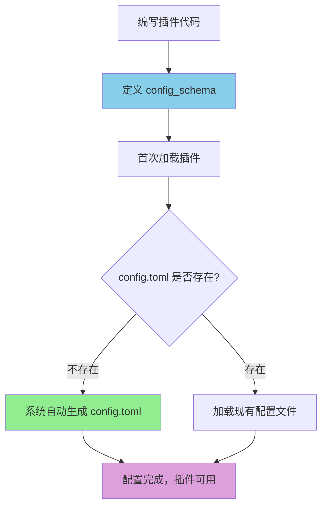

# ⚙️ 插件配置完整指南

本文档将全面指导你如何为你的插件**定义配置**和在组件中**访问配置**，帮助你构建一个健壮、规范且自带文档的配置系统。

> **🚨 重要原则：任何时候都不要手动创建 config.toml 文件！**
>
> 系统会根据你在代码中定义的 `config_schema` 自动生成配置文件。手动创建配置文件会破坏自动化流程，导致配置不一致、缺失注释和文档等问题。

## 📖 目录

1. [配置架构变更说明](#配置架构变更说明)
2. [配置定义：Schema驱动的配置系统](#配置定义schema驱动的配置系统)
3. [配置访问：在Action和Command中使用配置](#配置访问在action和command中使用配置)
4. [完整示例：从定义到使用](#完整示例从定义到使用)
5. [最佳实践与注意事项](#最佳实践与注意事项)

---

## 配置架构变更说明

- **`_manifest.json`** - 负责插件的**元数据信息**（静态）
  - 插件名称、版本、描述
  - 作者信息、许可证
  - 仓库链接、关键词、分类
  - 组件列表、兼容性信息

- **`config.toml`** - 负责插件的**运行时配置**（动态）
  - `enabled` - 是否启用插件
  - 功能参数配置
  - 组件启用开关
  - 用户可调整的行为参数


---

## 配置定义：Schema驱动的配置系统

### 核心理念：Schema驱动的配置

在新版插件系统中，我们引入了一套 **配置Schema（模式）驱动** 的机制。**你不需要也不应该手动创建和维护 `config.toml` 文件**，而是通过在插件代码中 **声明配置的结构**，系统将为你完成剩下的工作。

> **⚠️ 绝对不要手动创建 config.toml 文件！**
>
> - ❌ **错误做法**：手动在插件目录下创建 `config.toml` 文件
> - ✅ **正确做法**：在插件代码中定义 `config_schema`，让系统自动生成配置文件

**核心优势:**

- **自动化 (Automation)**: 如果配置文件不存在，系统会根据你的声明 **自动生成** 一份包含默认值和详细注释的 `config.toml` 文件。
- **规范化 (Standardization)**: 所有插件的配置都遵循统一的结构，提升了可维护性。
- **自带文档 (Self-documenting)**: 配置文件中的每一项都包含详细的注释、类型说明、可选值和示例，极大地降低了用户的使用门槛。
- **健壮性 (Robustness)**: 在代码中直接定义配置的类型和默认值，减少了因配置错误导致的运行时问题。
- **易于管理 (Easy Management)**: 生成的配置文件可以方便地加入 `.gitignore`，避免将个人配置（如API Key）提交到版本库。

### 配置生成工作流程



### 如何定义配置

配置的定义在你的插件主类（继承自 `BasePlugin`）中完成，主要通过两个类属性：

1.  `config_section_descriptions`: 一个字典，用于描述配置文件的各个区段（`[section]`）。
2.  `config_schema`: 核心部分，一个嵌套字典，用于定义每个区段下的具体配置项。

### `ConfigField`：配置项的基石

每个配置项都通过一个 `ConfigField` 对象来定义。

```python
from src.plugin_system.base.config_types import ConfigField

@dataclass
class ConfigField:
    """配置字段定义"""
    type: type          # 字段类型 (例如 str, int, float, bool, list)
    default: Any        # 默认值
    description: str    # 字段描述 (将作为注释生成到配置文件中)
    example: Optional[str] = None       # 示例值 (可选)
    required: bool = False              # 是否必需 (可选, 主要用于文档提示)
    choices: Optional[List[Any]] = None # 可选值列表 (可选)
```

### 配置定义示例

让我们以一个功能丰富的 `MutePlugin` 为例，看看如何定义它的配置。

```python
# src/plugins/built_in/mute_plugin/plugin.py

from src.plugin_system import BasePlugin, register_plugin
from src.plugin_system.base.config_types import ConfigField
from typing import List, Tuple, Type

@register_plugin
class MutePlugin(BasePlugin):
    """禁言插件"""

    # 插件基本信息
    plugin_name = "mute_plugin"
    plugin_description = "群聊禁言管理插件，提供智能禁言功能"
    plugin_version = "2.0.0"
    plugin_author = "MaiBot开发团队"
    enable_plugin = True
    config_file_name = "config.toml"

    # 步骤1: 定义配置节的描述
    config_section_descriptions = {
        "plugin": "插件启用配置",
        "components": "组件启用控制",
        "mute": "核心禁言功能配置",
        "smart_mute": "智能禁言Action的专属配置",
        "logging": "日志记录相关配置"
    }

    # 步骤2: 使用ConfigField定义详细的配置Schema
    config_schema = {
        "plugin": {
            "enabled": ConfigField(type=bool, default=False, description="是否启用插件")
        },
        "components": {
            "enable_smart_mute": ConfigField(type=bool, default=True, description="是否启用智能禁言Action"),
            "enable_mute_command": ConfigField(type=bool, default=False, description="是否启用禁言命令Command")
        },
        "mute": {
            "min_duration": ConfigField(type=int, default=60, description="最短禁言时长（秒）"),
            "max_duration": ConfigField(type=int, default=2592000, description="最长禁言时长（秒），默认30天"),
            "templates": ConfigField(
                type=list,
                default=["好的，禁言 {target} {duration}，理由：{reason}", "收到，对 {target} 执行禁言 {duration}"],
                description="成功禁言后发送的随机消息模板"
            )
        },
        "smart_mute": {
            "keyword_sensitivity": ConfigField(
                type=str,
                default="normal",
                description="关键词激活的敏感度",
                choices=["low", "normal", "high"] # 定义可选值
            ),
        },
        "logging": {
            "level": ConfigField(
                type=str,
                default="INFO",
                description="日志记录级别",
                choices=["DEBUG", "INFO", "WARNING", "ERROR"]
            ),
            "prefix": ConfigField(type=str, default="[MutePlugin]", description="日志记录前缀", example="[MyMutePlugin]")
        }
    }

    def get_plugin_components(self) -> List[Tuple[ComponentInfo, Type]]:
        # 在这里可以通过 self.get_config() 来获取配置值
        enable_smart_mute = self.get_config("components.enable_smart_mute", True)
        enable_mute_command = self.get_config("components.enable_mute_command", False)
        
        components = []
        if enable_smart_mute:
            components.append((SmartMuteAction.get_action_info(), SmartMuteAction))
        if enable_mute_command:
            components.append((MuteCommand.get_command_info(), MuteCommand))
        
        return components
```

### 自动生成的配置文件

当 `mute_plugin` 首次加载且其目录中不存在 `config.toml` 时，系统会自动创建以下文件：

```toml
# mute_plugin - 自动生成的配置文件
# 群聊禁言管理插件，提供智能禁言功能

# 插件启用配置
[plugin]

# 是否启用插件
enabled = false


# 组件启用控制
[components]

# 是否启用智能禁言Action
enable_smart_mute = true

# 是否启用禁言命令Command
enable_mute_command = false


# 核心禁言功能配置
[mute]

# 最短禁言时长（秒）
min_duration = 60

# 最长禁言时长（秒），默认30天
max_duration = 2592000

# 成功禁言后发送的随机消息模板
templates = ["好的，禁言 {target} {duration}，理由：{reason}", "收到，对 {target} 执行禁言 {duration}"]


# 智能禁言Action的专属配置
[smart_mute]

# 关键词激活的敏感度
# 可选值: low, normal, high
keyword_sensitivity = "normal"


# 日志记录相关配置
[logging]

# 日志记录级别
# 可选值: DEBUG, INFO, WARNING, ERROR
level = "INFO"

# 日志记录前缀
# 示例: [MyMutePlugin]
prefix = "[MutePlugin]"
```

---

## 配置访问：在Action和Command中使用配置

### 问题描述

在插件开发中，你可能遇到这样的问题：
- 想要在Action或Command中访问插件配置

### ✅ 解决方案

**直接使用 `self.get_config()` 方法！**

系统已经自动为你处理了配置传递，你只需要通过组件内置的 `get_config` 方法访问配置即可。

### 📖 快速示例

#### 在Action中访问配置

```python
from src.plugin_system import BaseAction

class MyAction(BaseAction):
    async def execute(self):
        # 方法1: 获取配置值（带默认值）
        api_key = self.get_config("api.key", "default_key")
        timeout = self.get_config("api.timeout", 30)
        
        # 方法2: 支持嵌套键访问
        log_level = self.get_config("advanced.logging.level", "INFO")
        
        # 方法3: 直接访问顶层配置
        enable_feature = self.get_config("features.enable_smart", False)
        
        # 使用配置值
        if enable_feature:
            await self.send_text(f"API密钥: {api_key}")
        
        return True, "配置访问成功"
```

#### 在Command中访问配置

```python
from src.plugin_system import BaseCommand

class MyCommand(BaseCommand):
    async def execute(self):
        # 使用方式与Action完全相同
        welcome_msg = self.get_config("messages.welcome", "欢迎！")
        max_results = self.get_config("search.max_results", 10)
        
        # 根据配置执行不同逻辑
        if self.get_config("features.debug_mode", False):
            await self.send_text(f"调试模式已启用，最大结果数: {max_results}")
        
        await self.send_text(welcome_msg)
        return True, "命令执行完成"
```

### 🔧 API方法详解

#### 1. `get_config(key, default=None)`

获取配置值，支持嵌套键访问：

```python
# 简单键
value = self.get_config("timeout", 30)

# 嵌套键（用点号分隔）
value = self.get_config("database.connection.host", "localhost")
value = self.get_config("features.ai.model", "gpt-3.5-turbo")
```

#### 2. 类型安全的配置访问

```python
# 确保正确的类型
max_retries = self.get_config("api.max_retries", 3)
if not isinstance(max_retries, int):
    max_retries = 3  # 使用安全的默认值

# 布尔值配置
debug_mode = self.get_config("features.debug_mode", False)
if debug_mode:
    # 调试功能逻辑
    pass
```

#### 3. 配置驱动的组件行为

```python
class ConfigDrivenAction(BaseAction):
    async def execute(self):
        # 根据配置决定激活行为
        activation_config = {
            "use_keywords": self.get_config("activation.use_keywords", True),
            "use_llm": self.get_config("activation.use_llm", False),
            "keywords": self.get_config("activation.keywords", []),
        }
        
        # 根据配置调整功能
        features = {
            "enable_emoji": self.get_config("features.enable_emoji", True),
            "enable_llm_reply": self.get_config("features.enable_llm_reply", False),
            "max_length": self.get_config("output.max_length", 200),
        }
        
        # 使用配置执行逻辑
        if features["enable_llm_reply"]:
            # 使用LLM生成回复
            pass
        else:
            # 使用模板回复
            pass
        
        return True, "配置驱动执行完成"
```

### 🔄 配置传递机制

系统自动处理配置传递，无需手动操作：

1. **插件初始化** → `BasePlugin`加载`config.toml`到`self.config`
2. **组件注册** → 系统记录插件配置
3. **组件实例化** → 自动传递`plugin_config`参数给Action/Command
4. **配置访问** → 组件通过`self.get_config()`直接访问配置

---

## 完整示例：从定义到使用

### 插件定义

```python
from src.plugin_system.base.config_types import ConfigField

@register_plugin
class GreetingPlugin(BasePlugin):
    """问候插件完整示例"""

    plugin_name = "greeting_plugin"
    plugin_description = "智能问候插件，展示配置定义和访问的完整流程"
    plugin_version = "1.0.0"
    config_file_name = "config.toml"

    # 配置节描述
    config_section_descriptions = {
        "plugin": "插件启用配置",
        "greeting": "问候功能配置",
        "features": "功能开关配置",
        "messages": "消息模板配置"
    }

    # 配置Schema定义
    config_schema = {
        "plugin": {
            "enabled": ConfigField(type=bool, default=True, description="是否启用插件")
        },
        "greeting": {
            "template": ConfigField(
                type=str, 
                default="你好，{username}！欢迎使用问候插件！", 
                description="问候消息模板"
            ),
            "enable_emoji": ConfigField(type=bool, default=True, description="是否启用表情符号"),
            "enable_llm": ConfigField(type=bool, default=False, description="是否使用LLM生成个性化问候")
        },
        "features": {
            "smart_detection": ConfigField(type=bool, default=True, description="是否启用智能检测"),
            "random_greeting": ConfigField(type=bool, default=False, description="是否使用随机问候语"),
            "max_greetings_per_hour": ConfigField(type=int, default=5, description="每小时最大问候次数")
        },
        "messages": {
            "custom_greetings": ConfigField(
                type=list,
                default=["你好！", "嗨！", "欢迎！"],
                description="自定义问候语列表"
            ),
            "error_message": ConfigField(
                type=str,
                default="问候功能暂时不可用",
                description="错误时显示的消息"
            )
        }
    }

    def get_plugin_components(self) -> List[Tuple[ComponentInfo, Type]]:
        """根据配置动态注册组件"""
        components = []
        
        # 根据配置决定是否注册组件
        if self.get_config("plugin.enabled", True):
            components.append((SmartGreetingAction.get_action_info(), SmartGreetingAction))
            components.append((GreetingCommand.get_command_info(), GreetingCommand))
        
        return components
```

### Action组件使用配置

```python
class SmartGreetingAction(BaseAction):
    """智能问候Action - 展示配置访问"""

    focus_activation_type = ActionActivationType.KEYWORD
    normal_activation_type = ActionActivationType.KEYWORD
    activation_keywords = ["你好", "hello", "hi"]

    async def execute(self) -> Tuple[bool, str]:
        """执行智能问候，大量使用配置"""
        try:
            # 检查插件是否启用
            if not self.get_config("plugin.enabled", True):
                return False, "插件已禁用"

            # 获取问候配置
            template = self.get_config("greeting.template", "你好，{username}！")
            enable_emoji = self.get_config("greeting.enable_emoji", True)
            enable_llm = self.get_config("greeting.enable_llm", False)

            # 获取功能配置
            smart_detection = self.get_config("features.smart_detection", True)
            random_greeting = self.get_config("features.random_greeting", False)
            max_per_hour = self.get_config("features.max_greetings_per_hour", 5)

            # 获取消息配置
            custom_greetings = self.get_config("messages.custom_greetings", [])
            error_message = self.get_config("messages.error_message", "问候功能不可用")

            # 根据配置执行不同逻辑
            username = self.action_data.get("username", "用户")
            
            if random_greeting and custom_greetings:
                # 使用随机自定义问候语
                import random
                greeting_msg = random.choice(custom_greetings)
            elif enable_llm:
                # 使用LLM生成个性化问候
                greeting_msg = await self._generate_llm_greeting(username)
            else:
                # 使用模板问候
                greeting_msg = template.format(username=username)

            # 发送问候消息
            await self.send_text(greeting_msg)

            # 根据配置发送表情
            if enable_emoji:
                await self.send_emoji("😊")

            return True, f"向{username}发送了问候"

        except Exception as e:
            # 使用配置的错误消息
            await self.send_text(self.get_config("messages.error_message", "出错了"))
            return False, f"问候失败: {str(e)}"

    async def _generate_llm_greeting(self, username: str) -> str:
        """根据配置使用LLM生成问候语"""
        # 这里可以进一步使用配置来定制LLM行为
        llm_style = self.get_config("greeting.llm_style", "friendly")
        # ... LLM调用逻辑
        return f"你好 {username}！很高兴见到你！"
```

### Command组件使用配置

```python
class GreetingCommand(BaseCommand):
    """问候命令 - 展示配置访问"""

    command_pattern = r"^/greet(?:\s+(?P<username>\w+))?$"
    command_help = "发送问候消息"
    command_examples = ["/greet", "/greet Alice"]

    async def execute(self) -> Tuple[bool, Optional[str]]:
        """执行问候命令"""
        # 检查功能是否启用
        if not self.get_config("plugin.enabled", True):
            await self.send_text("问候功能已禁用")
            return False, "功能禁用"

        # 获取用户名
        username = self.matched_groups.get("username", "用户")

        # 根据配置选择问候方式
        if self.get_config("features.random_greeting", False):
            custom_greetings = self.get_config("messages.custom_greetings", ["你好！"])
            import random
            greeting = random.choice(custom_greetings)
        else:
            template = self.get_config("greeting.template", "你好，{username}！")
            greeting = template.format(username=username)

        # 发送问候
        await self.send_text(greeting)

        # 根据配置发送表情
        if self.get_config("greeting.enable_emoji", True):
            await self.send_text("😊")

        return True, "问候发送成功"
```

---

## 最佳实践与注意事项

### 配置定义最佳实践

> **🚨 核心原则：永远不要手动创建 config.toml 文件！**

1.  **🔥 绝不手动创建配置文件**: **任何时候都不要手动创建 `config.toml` 文件**！必须通过在 `plugin.py` 中定义 `config_schema` 让系统自动生成。
    - ❌ **禁止**：`touch config.toml`、手动编写配置文件
    - ✅ **正确**：定义 `config_schema`，启动插件，让系统自动生成

2.  **Schema优先**: 所有配置项都必须在 `config_schema` 中声明，包括类型、默认值和描述。

3.  **描述清晰**: 为每个 `ConfigField` 和 `config_section_descriptions` 编写清晰、准确的描述。这会直接成为你的插件文档的一部分。

4.  **提供合理默认值**: 确保你的插件在默认配置下就能正常运行（或处于一个安全禁用的状态）。

5.  **gitignore**: 将 `plugins/*/config.toml` 或 `src/plugins/built_in/*/config.toml` 加入 `.gitignore`，以避免提交个人敏感信息。

6.  **配置文件只供修改**: 自动生成的 `config.toml` 文件只应该被用户**修改**，而不是从零创建。

### 配置访问最佳实践

#### 1. 总是提供默认值

```python
# ✅ 好的做法
timeout = self.get_config("api.timeout", 30)

# ❌ 避免这样做
timeout = self.get_config("api.timeout")  # 可能返回None
```

#### 2. 验证配置类型

```python
# 获取配置后验证类型
max_items = self.get_config("list.max_items", 10)
if not isinstance(max_items, int) or max_items <= 0:
    max_items = 10  # 使用安全的默认值
```

#### 3. 缓存复杂配置解析

```python
class MyAction(BaseAction):
    def __init__(self, *args, **kwargs):
        super().__init__(*args, **kwargs)
        # 在初始化时解析复杂配置，避免重复解析
        self._api_config = self._parse_api_config()
    
    def _parse_api_config(self):
        return {
            'key': self.get_config("api.key", ""),
            'timeout': self.get_config("api.timeout", 30),
            'retries': self.get_config("api.max_retries", 3)
        }
```

#### 4. 配置驱动的组件注册

```python
def get_plugin_components(self) -> List[Tuple[ComponentInfo, Type]]:
    """根据配置动态注册组件"""
    components = []
    
    # 从配置获取组件启用状态
    enable_action = self.get_config("components.enable_action", True)
    enable_command = self.get_config("components.enable_command", True)
    
    if enable_action:
        components.append((MyAction.get_action_info(), MyAction))
    if enable_command:
        components.append((MyCommand.get_command_info(), MyCommand))
    
    return components
```

### 🎉 总结

现在你掌握了插件配置的完整流程：

1. **定义配置**: 在插件中使用 `config_schema` 定义配置结构
2. **访问配置**: 在组件中使用 `self.get_config("key", default_value)` 访问配置
3. **自动生成**: 系统自动生成带注释的配置文件
4. **动态行为**: 根据配置动态调整插件行为

> **🚨 最后强调：任何时候都不要手动创建 config.toml 文件！**
>
> 让系统根据你的 `config_schema` 自动生成配置文件，这是插件系统的核心设计原则。

不需要继承`BasePlugin`，不需要复杂的配置传递，不需要手动创建配置文件，组件内置的`get_config`方法和自动化的配置生成机制已经为你准备好了一切！ 