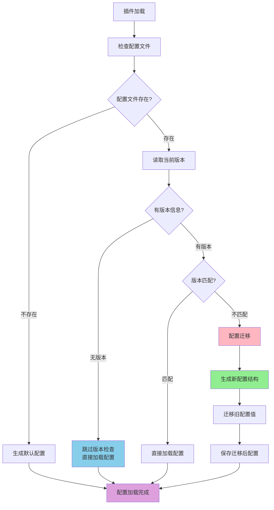

# ⚙️ 插件配置完整指南

本文档将全面指导你如何为你的插件**定义配置**和在组件中**访问配置**，帮助你构建一个健壮、规范且自带文档的配置系统。

> **🚨 重要原则：任何时候都不要手动创建 config.toml 文件！**
>
> 系统会根据你在代码中定义的 `config_schema` 自动生成配置文件。手动创建配置文件会破坏自动化流程，导致配置不一致、缺失注释和文档等问题。

## 配置版本管理

### 🎯 版本管理概述

插件系统提供了强大的**配置版本管理机制**，可以在插件升级时自动处理配置文件的迁移和更新，确保配置结构始终与代码保持同步。

### 🔄 配置版本管理工作流程



### 📊 版本管理策略

#### 1. 配置版本定义

在 `config_schema` 的 `plugin` 节中定义 `config_version`：

```python
config_schema = {
    "plugin": {
        "enabled": ConfigField(type=bool, default=False, description="是否启用插件"),
        "config_version": ConfigField(type=str, default="1.2.0", description="配置文件版本"),
    },
    # 其他配置...
}
```

#### 2. 版本检查行为

- **无版本信息** (`config_version` 不存在)
  - 系统会**跳过版本检查**，直接加载现有配置
  - 适用于旧版本插件的兼容性处理
  - 日志显示：`配置文件无版本信息，跳过版本检查`

- **有版本信息** (存在 `config_version` 字段)
  - 比较当前版本与期望版本
  - 版本不匹配时自动执行配置迁移
  - 版本匹配时直接加载配置

#### 3. 配置迁移过程

当检测到版本不匹配时，系统会：

1. **生成新配置结构** - 根据最新的 `config_schema` 生成新的配置结构
2. **迁移配置值** - 将旧配置文件中的值迁移到新结构中
3. **处理新增字段** - 新增的配置项使用默认值
4. **更新版本号** - `config_version` 字段自动更新为最新版本
5. **保存配置文件** - 迁移后的配置直接覆盖原文件**（不保留备份）**

### 🔧 实际使用示例

#### 版本升级场景

假设你的插件从 v1.0 升级到 v1.1，新增了权限管理功能：

**旧版本配置 (v1.0.0):**
```toml
[plugin]
enabled = true
config_version = "1.0.0"

[mute]
min_duration = 60
max_duration = 3600
```

**新版本Schema (v1.1.0):**
```python
config_schema = {
    "plugin": {
        "enabled": ConfigField(type=bool, default=False, description="是否启用插件"),
        "config_version": ConfigField(type=str, default="1.1.0", description="配置文件版本"),
    },
    "mute": {
        "min_duration": ConfigField(type=int, default=60, description="最短禁言时长（秒）"),
        "max_duration": ConfigField(type=int, default=2592000, description="最长禁言时长（秒）"),
    },
    "permissions": {  # 新增的配置节
        "allowed_users": ConfigField(type=list, default=[], description="允许的用户列表"),
        "allowed_groups": ConfigField(type=list, default=[], description="允许的群组列表"),
    }
}
```

**迁移后配置 (v1.1.0):**
```toml
[plugin]
enabled = true  # 保留原值
config_version = "1.1.0"  # 自动更新

[mute]
min_duration = 60  # 保留原值
max_duration = 3600  # 保留原值

[permissions]  # 新增节，使用默认值
allowed_users = []
allowed_groups = []
```

#### 无版本配置的兼容性

对于没有版本信息的旧配置文件：

**旧配置文件（无版本）:**
```toml
[plugin]
enabled = true
# 没有 config_version 字段

[mute]
min_duration = 120
```

**系统行为:**
- 检测到无版本信息
- 跳过版本检查和迁移
- 直接加载现有配置
- 新增的配置项在代码中使用默认值访问
- 系统会详细记录配置迁移过程。

### ⚠️ 重要注意事项

#### 1. 版本号管理
- 当你修改 `config_schema` 时，**必须同步更新** `config_version`
- 请使用语义化版本号 (例如：`1.0.0`, `1.1.0`, `2.0.0`)

#### 2. 迁移策略
- **保留原值优先**: 迁移时优先保留用户的原有配置值
- **新增字段默认值**: 新增的配置项使用Schema中定义的默认值
- **移除字段警告**: 如果某个配置项在新版本中被移除，会在日志中显示警告

#### 3. 兼容性考虑
- **旧版本兼容**: 无版本信息的配置文件会跳过版本检查
- **不保留备份**: 迁移后直接覆盖原配置文件，不保留备份
- **失败安全**: 如果迁移过程中出现错误，会回退到原配置

## 配置定义

配置的定义在你的插件主类（继承自 `BasePlugin`）中完成，主要通过两个类属性：

1.  `config_section_descriptions`: 一个字典，用于描述配置文件的各个区段（`[section]`）。
2.  `config_schema`: 核心部分，一个嵌套字典，用于定义每个区段下的具体配置项。

### `ConfigField`：配置项的基石

每个配置项都通过一个 `ConfigField` 对象来定义。

```python
from dataclasses import dataclass
from src.plugin_system.base.config_types import ConfigField

@dataclass
class ConfigField:
    """配置字段定义"""
    type: type          # 字段类型 (例如 str, int, float, bool, list)
    default: Any        # 默认值
    description: str    # 字段描述 (将作为注释生成到配置文件中)
    example: Optional[str] = None       # 示例值 (可选)
    required: bool = False              # 是否必需 (可选, 主要用于文档提示)
    choices: Optional[List[Any]] = None # 可选值列表 (可选)
```

### 配置示例

让我们以一个功能丰富的 `MutePlugin` 为例，看看如何定义它的配置。

```python
# src/plugins/built_in/mute_plugin/plugin.py

from src.plugin_system import BasePlugin, register_plugin, ConfigField
from typing import List, Tuple, Type

@register_plugin
class MutePlugin(BasePlugin):
    """禁言插件"""

    # 这里是插件基本信息，略去

    # 步骤1: 定义配置节的描述
    config_section_descriptions = {
        "plugin": "插件启用配置",
        "components": "组件启用控制",
        "mute": "核心禁言功能配置",
        "smart_mute": "智能禁言Action的专属配置",
        "logging": "日志记录相关配置"
    }

    # 步骤2: 使用ConfigField定义详细的配置Schema
    config_schema = {
        "plugin": {
            "enabled": ConfigField(type=bool, default=False, description="是否启用插件")
        },
        "components": {
            "enable_smart_mute": ConfigField(type=bool, default=True, description="是否启用智能禁言Action"),
            "enable_mute_command": ConfigField(type=bool, default=False, description="是否启用禁言命令Command")
        },
        "mute": {
            "min_duration": ConfigField(type=int, default=60, description="最短禁言时长（秒）"),
            "max_duration": ConfigField(type=int, default=2592000, description="最长禁言时长（秒），默认30天"),
            "templates": ConfigField(
                type=list,
                default=["好的，禁言 {target} {duration}，理由：{reason}", "收到，对 {target} 执行禁言 {duration}"],
                description="成功禁言后发送的随机消息模板"
            )
        },
        "smart_mute": {
            "keyword_sensitivity": ConfigField(
                type=str,
                default="normal",
                description="关键词激活的敏感度",
                choices=["low", "normal", "high"] # 定义可选值
            ),
        },
        "logging": {
            "level": ConfigField(
                type=str,
                default="INFO",
                description="日志记录级别",
                choices=["DEBUG", "INFO", "WARNING", "ERROR"]
            ),
            "prefix": ConfigField(type=str, default="[MutePlugin]", description="日志记录前缀", example="[MyMutePlugin]")
        }
    }

    # 这里是插件方法，略去
```

当 `mute_plugin` 首次加载且其目录中不存在 `config.toml` 时，系统会自动创建以下文件：

```toml
# mute_plugin - 自动生成的配置文件
# 群聊禁言管理插件，提供智能禁言功能

# 插件启用配置
[plugin]

# 是否启用插件
enabled = false


# 组件启用控制
[components]

# 是否启用智能禁言Action
enable_smart_mute = true

# 是否启用禁言命令Command
enable_mute_command = false


# 核心禁言功能配置
[mute]

# 最短禁言时长（秒）
min_duration = 60

# 最长禁言时长（秒），默认30天
max_duration = 2592000

# 成功禁言后发送的随机消息模板
templates = ["好的，禁言 {target} {duration}，理由：{reason}", "收到，对 {target} 执行禁言 {duration}"]


# 智能禁言Action的专属配置
[smart_mute]

# 关键词激活的敏感度
# 可选值: low, normal, high
keyword_sensitivity = "normal"


# 日志记录相关配置
[logging]

# 日志记录级别
# 可选值: DEBUG, INFO, WARNING, ERROR
level = "INFO"

# 日志记录前缀
# 示例: [MyMutePlugin]
prefix = "[MutePlugin]"
```

---

## 配置访问

如果你想要在你的组件中访问配置，可以通过组件内置的 `get_config()` 方法访问配置。

其参数为一个命名空间化的字符串。以上面的 `MutePlugin` 为例，你可以这样访问配置：

```python
enable_smart_mute = self.get_config("components.enable_smart_mute", True)
```

如果尝试访问了一个不存在的配置项，系统会自动返回默认值（你传递的）或者 `None`。

---

## 最佳实践与注意事项


**🚨 核心原则：永远不要手动创建 config.toml 文件！**

1.  **🔥 绝不手动创建配置文件**: **任何时候都不要手动创建 `config.toml` 文件**！必须通过在 `plugin.py` 中定义 `config_schema` 让系统自动生成。
    - ❌ **禁止**：`touch config.toml`、手动编写配置文件
    - ✅ **正确**：定义 `config_schema`，启动插件，让系统自动生成

2.  **Schema优先**: 所有配置项都必须在 `config_schema` 中声明，包括类型、默认值和描述。

3.  **描述清晰**: 为每个 `ConfigField` 和 `config_section_descriptions` 编写清晰、准确的描述。这会直接成为你的插件文档的一部分。

4.  **提供合理默认值**: 确保你的插件在默认配置下就能正常运行（或处于一个安全禁用的状态）。

5.  **gitignore**: 将 `plugins/*/config.toml` 或 `src/plugins/built_in/*/config.toml` 加入 `.gitignore`，以避免提交个人敏感信息。

6.  **配置文件只供修改**: 自动生成的 `config.toml` 文件只应该被用户**修改**，而不是从零创建。