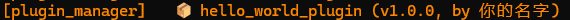
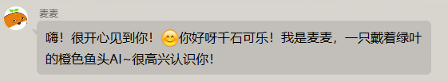

# 🚀 快速开始指南

本指南将带你从零开始创建一个功能完整的MaiCore插件。

## 📖 概述

这个指南将带你快速创建你的第一个MaiCore插件。我们将创建一个简单的问候插件，展示插件系统的基本概念。

以下代码都在我们的`plugins/hello_world_plugin/`目录下。

### 一个方便的小设计

在开发中，我们在`__init__.py`中定义了一个`__all__`变量，包含了所有需要导出的类和函数。
这样在其他地方导入时，可以直接使用 `from src.plugin_system import *` 来导入所有插件相关的类和函数。
或者你可以直接使用 `from src.plugin_system import BasePlugin, register_plugin, ComponentInfo` 之类的方式来导入你需要的部分。

### 📂 准备工作

确保你已经：

1. 克隆了MaiCore项目
2. 安装了Python依赖
3. 了解基本的Python语法

## 🏗️ 创建插件

### 1. 创建插件目录

在项目根目录的 `plugins/` 文件夹下创建你的插件目录

这里我们创建一个名为 `hello_world_plugin` 的目录

### 2. 创建`_manifest.json`文件

在插件目录下面创建一个 `_manifest.json` 文件，内容如下：

```json
{
  "manifest_version": 1,
  "name": "Hello World 插件",
  "version": "1.0.0",
  "description": "一个简单的 Hello World 插件",
  "author": {
    "name": "你的名字"
  }
}
```

有关 `_manifest.json` 的详细说明，请参考 [Manifest文件指南](./manifest-guide.md)。

### 3. 创建最简单的插件

让我们从最基础的开始！创建 `plugin.py` 文件：

```python
from typing import List, Tuple, Type
from src.plugin_system import BasePlugin, register_plugin, ComponentInfo

@register_plugin # 注册插件
class HelloWorldPlugin(BasePlugin):
    """Hello World插件 - 你的第一个MaiCore插件"""

    # 以下是插件基本信息和方法（必须填写）
    plugin_name = "hello_world_plugin"
    enable_plugin = True  # 启用插件
    dependencies = []  # 插件依赖列表（目前为空）
    python_dependencies = []  # Python依赖列表（目前为空）
    config_file_name = "config.toml"  # 配置文件名
    config_schema = {}  # 配置文件模式（目前为空）

    def get_plugin_components(self) -> List[Tuple[ComponentInfo, Type]]: # 获取插件组件
        """返回插件包含的组件列表（目前是空的）"""
        return []
```

🎉 恭喜！你刚刚创建了一个最简单但完整的MaiCore插件！

**解释一下这些代码：**

- 首先，我们在`plugin.py`中定义了一个HelloWorldPlugin插件类，继承自 `BasePlugin` ，提供基本功能。
- 通过给类加上，`@register_plugin` 装饰器，我们告诉系统"这是一个插件"
- `plugin_name` 等是插件的基本信息，必须填写
- `get_plugin_components()` 返回插件的功能组件，现在我们没有定义任何 Action, Command 或者 EventHandler，所以返回空列表。

### 4. 测试基础插件

现在就可以测试这个插件了！启动MaiCore：

直接通过启动器运行MaiCore或者 `python bot.py`

在日志中你应该能看到插件被加载的信息。虽然插件还没有任何功能，但它已经成功运行了！



### 5. 添加第一个功能：问候Action

现在我们要给插件加入一个有用的功能，我们从最好玩的Action做起

Action是一类可以让MaiCore根据自身意愿选择使用的“动作”，在MaiCore中，不论是“回复”还是“不回复”，或者“发送表情”以及“禁言”等等，都是通过Action实现的。

你可以通过编写动作，来拓展MaiCore的能力，包括发送语音，截图，甚至操作文件，编写代码......

现在让我们给插件添加第一个简单的功能。这个Action可以对用户发送一句问候语。

在 `plugin.py` 文件中添加Action组件，完整代码如下：

```python
from typing import List, Tuple, Type
from src.plugin_system import (
    BasePlugin, register_plugin, BaseAction, 
    ComponentInfo, ActionActivationType, ChatMode
)

# ===== Action组件 =====

class HelloAction(BaseAction):
    """问候Action - 简单的问候动作"""

    # === 基本信息（必须填写）===
    action_name = "hello_greeting"
    action_description = "向用户发送问候消息"
    activation_type = ActionActivationType.ALWAYS  # 始终激活

    # === 功能描述（必须填写）===
    action_parameters = {"greeting_message": "要发送的问候消息"}
    action_require = ["需要发送友好问候时使用", "当有人向你问好时使用", "当你遇见没有见过的人时使用"]
    associated_types = ["text"]

    async def execute(self) -> Tuple[bool, str]:
        """执行问候动作 - 这是核心功能"""
        # 发送问候消息
        greeting_message = self.action_data.get("greeting_message", "")
        base_message = self.get_config("greeting.message", "嗨！很开心见到你！😊")
        message = base_message + greeting_message
        await self.send_text(message)

        return True, "发送了问候消息"

@register_plugin
class HelloWorldPlugin(BasePlugin):
    """Hello World插件 - 你的第一个MaiCore插件"""

    # 插件基本信息
    plugin_name = "hello_world_plugin"
    enable_plugin = True
    dependencies = []
    python_dependencies = []
    config_file_name = "config.toml"
    config_schema = {}

    def get_plugin_components(self) -> List[Tuple[ComponentInfo, Type]]:
        """返回插件包含的组件列表"""
        return [
            # 添加我们的问候Action
            (HelloAction.get_action_info(), HelloAction),
        ]
```

**解释一下这些代码：**

- `HelloAction` 是我们定义的问候动作类，继承自 `BaseAction`，并实现了核心功能。
- 在 `HelloWorldPlugin` 中，我们通过 `get_plugin_components()` 方法，通过调用`get_action_info()`这个内置方法将 `HelloAction` 注册为插件的一个组件。
- 这样一来，当插件被加载时，问候动作也会被一并加载，并可以在MaiCore中使用。
- `execute()` 函数是Action的核心，定义了当Action被MaiCore选择后，具体要做什么
- `self.send_text()` 是发送文本消息的便捷方法

Action 组件中有关`activation_type`、`action_parameters`、`action_require`、`associated_types` 等的详细说明请参考 [Action组件指南](./action-components.md)。

### 6. 测试问候Action

重启MaiCore，然后在聊天中发送任意消息，比如：

```
你好
```

MaiCore可能会选择使用你的问候Action，发送回复：

```
嗨！很开心见到你！😊
```



> **💡 小提示**：MaiCore会智能地决定什么时候使用它。如果没有立即看到效果，多试几次不同的消息。

🎉 太棒了！你的插件已经有实际功能了！

### 7. 添加第二个功能：时间查询Command

现在让我们添加一个Command组件。Command和Action不同，它是直接响应用户命令的：

Command是最简单，最直接的响应，不由LLM判断选择使用

```python
# 在现有代码基础上，添加Command组件
import datetime
from src.plugin_system import BaseCommand
#导入Command基类

class TimeCommand(BaseCommand):
    """时间查询Command - 响应/time命令"""

    command_name = "time"
    command_description = "查询当前时间"

    # === 命令设置（必须填写）===
    command_pattern = r"^/time$"  # 精确匹配 "/time" 命令

    async def execute(self) -> Tuple[bool, Optional[str], bool]:
        """执行时间查询"""
        # 获取当前时间
        time_format: str = "%Y-%m-%d %H:%M:%S"
        now = datetime.datetime.now()
        time_str = now.strftime(time_format)

        # 发送时间信息
        message = f"⏰ 当前时间：{time_str}"
        await self.send_text(message)

        return True, f"显示了当前时间: {time_str}", True

@register_plugin
class HelloWorldPlugin(BasePlugin):
    """Hello World插件 - 你的第一个MaiCore插件"""

    # 插件基本信息
    plugin_name = "hello_world_plugin"
    enable_plugin = True
    dependencies = []
    python_dependencies = []
    config_file_name = "config.toml"
    config_schema = {}

    def get_plugin_components(self) -> List[Tuple[ComponentInfo, Type]]:
        return [
            (HelloAction.get_action_info(), HelloAction),
            (TimeCommand.get_command_info(), TimeCommand),
        ]
```

同样的，我们通过 `get_plugin_components()` 方法，通过调用`get_action_info()`这个内置方法将 `TimeCommand` 注册为插件的一个组件。

**Command组件解释：**

- `command_pattern` 使用正则表达式匹配用户输入
- `^/time$` 表示精确匹配 "/time"

有关 Command 组件的更多信息，请参考 [Command组件指南](./command-components.md)。

### 8. 测试时间查询Command

重启MaiCore，发送命令：

```
/time
```

你应该会收到回复：

```
⏰ 当前时间：2024-01-01 12:00:00
```

🎉 太棒了！现在你已经了解了基本的 Action 和 Command 组件的使用方法。你可以根据自己的需求，继续扩展插件的功能，添加更多的 Action 和 Command 组件，让你的插件更加丰富和强大！

---

## 进阶教程

如果你想让插件更加灵活和强大，可以参考接下来的进阶教程。

### 1. 添加配置文件

想要为插件添加配置文件吗？让我们一起来配置`config_schema`属性！

> **🚨 重要：不要手动创建config.toml文件！**
>
> 我们需要在插件代码中定义配置Schema，让系统自动生成配置文件。

首先，在插件类中定义配置Schema：

```python
from src.plugin_system import ConfigField

@register_plugin
class HelloWorldPlugin(BasePlugin):
    """Hello World插件 - 你的第一个MaiCore插件"""

    # 插件基本信息
    plugin_name: str = "hello_world_plugin"  # 内部标识符
    enable_plugin: bool = True
    dependencies: List[str] = []  # 插件依赖列表
    python_dependencies: List[str] = []  # Python包依赖列表
    config_file_name: str = "config.toml"  # 配置文件名

    # 配置Schema定义
    config_schema: dict = {
        "plugin": {
            "name": ConfigField(type=str, default="hello_world_plugin", description="插件名称"),
            "version": ConfigField(type=str, default="1.0.0", description="插件版本"),
            "enabled": ConfigField(type=bool, default=False, description="是否启用插件"),
        },
        "greeting": {
            "message": ConfigField(type=str, default="嗨！很开心见到你！😊", description="默认问候消息"),
            "enable_emoji": ConfigField(type=bool, default=True, description="是否启用表情符号"),
        },
        "time": {"format": ConfigField(type=str, default="%Y-%m-%d %H:%M:%S", description="时间显示格式")},
    }

    def get_plugin_components(self) -> List[Tuple[ComponentInfo, Type]]:
        return [
            (HelloAction.get_action_info(), HelloAction),
            (TimeCommand.get_command_info(), TimeCommand),
        ]
```

这会生成一个如下的 `config.toml` 文件：

```toml
# hello_world_plugin - 自动生成的配置文件
# 我的第一个MaiCore插件，包含问候功能和时间查询等基础示例

# 插件基本信息
[plugin]

# 插件名称
name = "hello_world_plugin"

# 插件版本
version = "1.0.0"

# 是否启用插件
enabled = false


# 问候功能配置
[greeting]

# 默认问候消息
message = "嗨！很开心见到你！😊"

# 是否启用表情符号
enable_emoji = true


# 时间查询配置
[time]

# 时间显示格式
format = "%Y-%m-%d %H:%M:%S"
```

然后修改Action和Command代码，通过 `get_config()` 方法让它们读取配置（配置的键是命名空间式的）：

```python
class HelloAction(BaseAction):
    """问候Action - 简单的问候动作"""

    # === 基本信息（必须填写）===
    action_name = "hello_greeting"
    action_description = "向用户发送问候消息"
    activation_type = ActionActivationType.ALWAYS  # 始终激活

    # === 功能描述（必须填写）===
    action_parameters = {"greeting_message": "要发送的问候消息"}
    action_require = ["需要发送友好问候时使用", "当有人向你问好时使用", "当你遇见没有见过的人时使用"]
    associated_types = ["text"]

    async def execute(self) -> Tuple[bool, str]:
        """执行问候动作 - 这是核心功能"""
        # 发送问候消息
        greeting_message = self.action_data.get("greeting_message", "")
        base_message = self.get_config("greeting.message", "嗨！很开心见到你！😊")
        message = base_message + greeting_message
        await self.send_text(message)

        return True, "发送了问候消息"

class TimeCommand(BaseCommand):
    """时间查询Command - 响应/time命令"""

    command_name = "time"
    command_description = "查询当前时间"

    # === 命令设置（必须填写）===
    command_pattern = r"^/time$"  # 精确匹配 "/time" 命令

    async def execute(self) -> Tuple[bool, str, bool]:
        """执行时间查询"""
        import datetime

        # 获取当前时间
        time_format: str = self.get_config("time.format", "%Y-%m-%d %H:%M:%S")  # type: ignore
        now = datetime.datetime.now()
        time_str = now.strftime(time_format)

        # 发送时间信息
        message = f"⏰ 当前时间：{time_str}"
        await self.send_text(message)

        return True, f"显示了当前时间: {time_str}", True
```

**配置系统工作流程：**

1. **定义Schema**: 在插件代码中定义配置结构
2. **自动生成**: 启动插件时，系统会自动生成 `config.toml` 文件
3. **用户修改**: 用户可以修改生成的配置文件
4. **代码读取**: 使用 `self.get_config()` 读取配置值

**绝对不要手动创建 `config.toml` 文件！**

更详细的配置系统介绍请参考 [配置指南](./configuration-guide.md)。

### 2. 创建说明文档

你可以创建一个 `README.md` 文件，描述插件的功能和使用方法。

### 3. 发布到插件市场

如果你想让更多人使用你的插件，可以将它发布到MaiCore的插件市场。

这部分请参考 [plugin-repo](https://github.com/Maim-with-u/plugin-repo) 的文档。

---

🎉 恭喜你！你已经成功的创建了自己的插件了！
